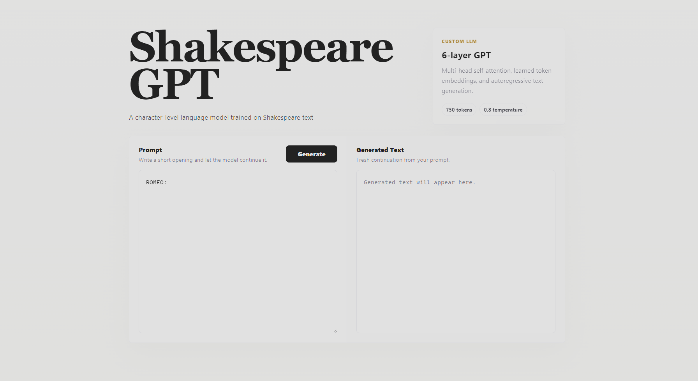
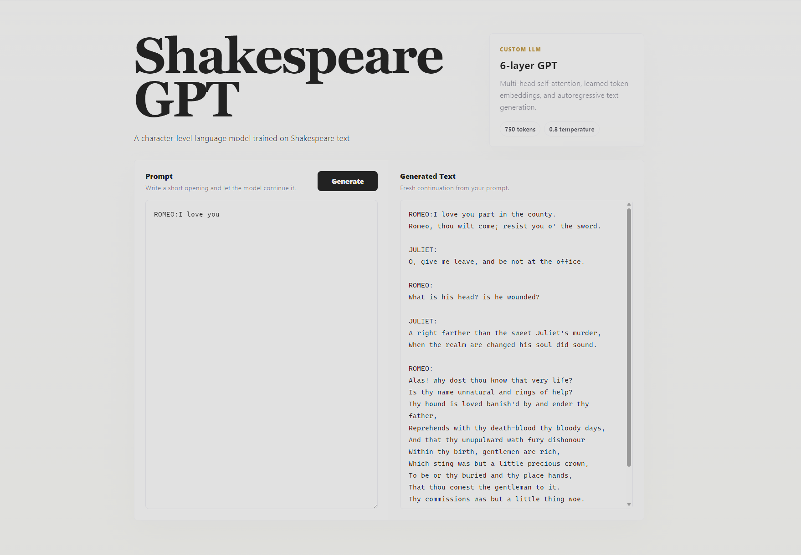

# ShakespeareGPT: GPT-Style Language Model with Web UI



A GPT-style decoder-only language model implemented entirely from scratch using PyTorch and trained on the Shakespeare dataset at the character level.

The project recreates the core building blocks of modern autoregressive language models, including character tokenization, positional embeddings, multi-head self-attention, transformer blocks, and autoregressive text generation. The trained model is integrated into a lightweight Flask web application for interactive text generation through a browser interface.

## Project Overview

This project was built to gain a deep understanding of GPT-style language models by implementing the complete decoder-only Transformer architecture from scratch instead of relying on high-level libraries.

The model is trained using next-token prediction on Shakespeare's complete works and can generate Shakespeare-style text from custom prompts through an interactive web interface.



## Model Architecture

Custom decoder-only Transformer architecture including:

- Character-level tokenizer
- Token embedding layer
- Learned positional embeddings
- Multi-Head Self-Attention
- Residual connections
- Layer Normalization
- Feed Forward Networks (MLP)
- Stacked Transformer blocks
- Final language modeling head

## Training Pipeline

Implemented modern language model training techniques including:

- Character-level next-token prediction
- Cross Entropy Loss
- AdamW optimizer
- Learning rate warmup
- Gradient clipping
- Train/Test split evaluation
- Periodic validation during training
- CUDA GPU acceleration
- Model checkpointing
- Temperature-controlled autoregressive text generation

## Project Structure

```text
ShakespeareGPT_Scratch_With_UI/
│
├── app.py              # Flask web application
├── dataset.py          # Dataset loading and character tokenizer
├── inference.py        # Text generation pipeline
├── model.py            # GPT model architecture
├── model.pt            # Trained model weights
├── paths.py            # Project path configuration
├── requirements.txt    # Project dependencies
│
├── templates/          # HTML templates
├── static/             # CSS, JavaScript and static assets
│
├── model3.png          # Project screenshot
├── model4.png          # Project screenshot
├── .gitignore
└── README.md
```

## Results

- Dataset: Shakespeare
- Language Modeling: Character-level
- Vocabulary Size: 65 characters
- Context Length: 256 tokens
- Embedding Dimension: 384
- Transformer Layers: 6
- Attention Heads: 6
- Batch Size: 64
- Training Iterations: 5000
- Final Test Loss: **2.086**

## Technologies

- Python
- PyTorch
- Flask
- HTML
- CSS
- JavaScript
- CUDA

## Features

- GPT-style decoder-only Transformer implemented from scratch
- Character-level tokenizer
- Multi-Head Self-Attention
- Learned positional embeddings
- Autoregressive text generation
- Complete training pipeline
- Model checkpointing
- GPU-accelerated training
- Interactive Flask-based web interface
- Browser-based prompt input and text generation
